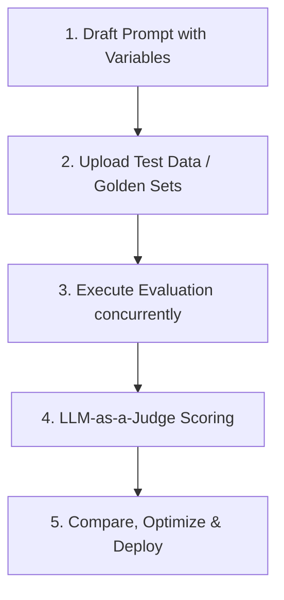

# 🎯 PromptLens — Enterprise-Grade Prompt Evaluation SaaS

PromptLens is a premium, high-performance AI prompt evaluation, testing, and optimization SaaS. Built using Next.js 15, React 19, Tailwind CSS, Prisma, Neon PostgreSQL, and Clerk Authentication, it empowers non-technical users and staff developers to create, test, compare, and deploy LLM prompts (OpenAI and Gemini) safely and visually.

---

## ⚙️ How It Works (The Lifecycle)

PromptLens structures the prompt optimization cycle into five clear, repeatable steps:



1.  **Draft Prompts with Dynamic Variables:**
    Use the guided Prompt Wizard to create custom prompt instructions containing dynamic placeholders (e.g. `{{support_ticket}}` or `{{customer_name}}`). Choose baseline temperature, model, and token settings.
2.  **Upload Ingestion Datasets (Test Data):**
    Upload golden benchmark datasets in CSV or JSONL format. Each row serves as a single test case, defining parameters to substitute for your prompt variables along with expected target outputs.
3.  **Launch Multi-Model Test Runs:**
    Select which prompts and test datasets to combine. Choose the provider models to evaluate against (e.g., OpenAI GPT models, Gemini LLMs). PromptLens parses your datasets, replaces variables, and issues parallel concurrent queries to the live provider endpoints, collecting outputs, latencies, token counts, and cost data.
4.  **Real-Time LLM-as-a-Judge Scoring:**
    As responses complete, they are fed to a dedicated LLM judge (`gpt-4o-mini`). The judge evaluates the outputs across **four quality dimensions**: *Correctness*, *Relevance*, *Completeness*, and *Clarity*. It issues individual breakdown scores and a cumulative 0-100 grade, saving outcomes instantly to PostgreSQL.
5.  **Compare Matrix & Version Promotion:**
    Compare model responses side-by-side inside the comparison matrix. Check latency, cost, and risk profiles. Based on outcomes, iterate on prompt versions and promote the highest-scoring draft to the active "Live" stage.

---

## 🗺️ Project Architecture & Folder Structure

*   `src/app/` — **Next.js 15 App Router Pages & API Route Handlers** (routing infrastructure and endpoints).
*   `src/components/` — **Shared & Global Component System** (layout shell, command palette, navigation sidebar, base UI elements).
*   `src/features/` — **Client-Side Views & Core Logical Forms** (dashboard views, prompt wizards, dataset uploaders, evaluation panels).
*   `src/services/` — **Backend Engine Pipelines & Integrations** (OpenAI / Gemini model connectors, CSV/JSONL parsing, LLM-as-a-judge scorers, database access).
*   `src/lib/` — **Global Configs & Helpers** (Prisma client singleton, mock-data fallback registry, HSL formatting).
*   `src/types/` — **Type System Definitions** (shared TypeScript domain types and payload interface signatures).
*   `prisma/` — **Database Layer Configuration** (Prisma schema, dynamic seed script, model migration configurations).

---

## 🖥️ Page-by-Page Detailed Breakdown

### 1. 🏠 Landing Page (`/`)
The front-facing landing page provides a clear explanation of PromptLens's core value proposition for teams.
*   **Key Sections:**
    *   **Hero Banner:** Introduction highlighting prompt evaluation, version control, and multi-model testing.
    *   **Core Capabilities Grid:** Visual cards detailing dataset-backed evals, prompt comparison matrix, and LLM-as-judge scoring.
    *   **Feature Overview Card:** Displaying mock statistics (stored runs, versions, cost tracking).
    *   **Quick Entry Buttons:** Instant redirects to `Open workspace` or `Run evaluation`.

### 2. 📊 Dashboard (`/dashboard`)
The central workspace hub designed to onboard users, seed starter prompt structures, and display high-level platform status.
*   **Key Sections:**
    *   **Interactive Onboarding Wizard:** Appears on first login. Asks "What are you using AI for?" (Marketing, Customer Support, Coding, Legal) and dynamically seeds the database with matching templates.
    *   **KPI Statistics Section:** Plain-English metrics with informational hover tooltips (`ⓘ`):
        *   **Prompts Created:** Total unique prompt configurations in the workspace.
        *   **Tests Run:** Total evaluation sessions completed.
        *   **Average Score:** Combined benchmark success rate (0-100).
        *   **Estimated Cost Saved:** Financial overhead avoided via optimized prompts.
    *   **Action Hub:** Quick buttons to `+ Create Prompt`, `🧪 Test Prompt`, and `📂 Import Test Data`.
    *   **Performance Chart:** Interactive, beautiful HSL-themed line chart tracking score, pass rate, latency, and cost over time.

### 3. ✨ Prompts Overview (`/prompts`)
The management panel for all drafted prompt configurations.
*   **Key Sections:**
    *   **Prompts Registry:** List of all created prompts with descriptions, active model, and tags.
    *   **Prompt Search:** Dynamic real-time workspace query bar.
    *   **Version Badges:** Shows the active version numbers and current deployment lanes.

### 4. 🧙 Prompt Creator Wizard (`/prompts/new`)
A beautiful, guided 3-step wizard that simplifies creating complex prompt setups for non-technical users.
*   **Key Sections:**
    *   **Step 1 — General Info:** Name, description, and custom tags. Includes starter recommendations.
    *   **Step 2 — Prompt Text:** Input boxes for system instructions and user instructions with dynamic variables.
    *   **Step 3 — AI settings:** Selector for provider model, temperature slider, and max token configurations.

### 5. 🔍 Prompt Details (`/prompts/[id]`)
The versioning and promotion dashboard for individual prompts.
*   **Key Sections:**
    *   **Version History timeline:** Scrollable feed displaying system prompts, user prompts, temperatures, and model settings for every saved version.
    *   **Deployment Stages:** Shows what version is currently promoted to `Original`, `Draft`, or `Live`.
    *   **New Version Draft Creator:** Forms to immediately draft, test, and save a new version under this prompt tree.

### 6. 🧪 Evaluation Runner (`/evaluations`)
The central benchmark interface to configure and launch prompt runs against datasets.
*   **Key Sections:**
    *   **Run Configuration Panel:** Select a prompt, select a benchmark test dataset, and choose model check-boxes (e.g. GPT-4o, Gemini 1.5 Pro).
    *   **Test Session Log:** Tabular log showing historical runs, total test cases evaluated, average score, average latency, and pass rates.

### 7. 📈 Evaluation Results Deep-Dive (`/evaluations/[id]`)
A granular metrics dashboard summarizing the outcome of a specific test session.
*   **Key Sections:**
    *   **High-Level KPI cards:** Score (out of 100), Cost (USD), Token Usage, and Latency (ms).
    *   **Detailed Results Table:** View outputs for each test case alongside hallucination risk levels and latency.
    *   **LLM-as-a-Judge Breakdown:** Five-dimensional scoring metrics for each output:
        *   *Correctness* · *Relevance* · *Completeness* · *Clarity* · *LLM Judge Score*.

### 8. 📂 Test Data Ingestion (`/datasets`)
The upload and management hub for golden benchmark test sets.
*   **Key Sections:**
    *   **Uploader Panel:** Drag-and-drop or select interface supporting CSV and JSONL parsing pipelines.
    *   **Dataset Registry:** View datasets, description, creation date, and total number of test cases contained.

### 9. 📋 Test Case Explorer (`/datasets/[id]`)
Tabular workspace showing all test cases loaded in a dataset.
*   **Key Sections:**
    *   **Test Cases Matrix:** Columns for input parameters, expected outputs, task categories, difficulty, and custom tags.
    *   **Complexity Metrics:** Charts showing difficulty breakdowns (Easy, Medium, Hard counts).

### 10. 🔄 Prompt Comparison Matrix (`/comparisons`)
A side-by-side grid comparing version outputs on identical test sets.
*   **Key Sections:**
    *   **Comparison Grid:** Evaluates V1, V2, and V3 output models side-by-side on the same test cases.
    *   **Performance Metrics:** Instantly compare cost, score, and latency across drafts.

### 11. 📊 PDF/CSV Analytics (`/reports`)
Report export center.
*   **Key Sections:**
    *   **Export Controls:** Actions to instantly compile and download tabular benchmark datasets as CSV or PDF documents.
    *   **Historical Reports:** Feed displaying summaries of previously completed reports.

### 12. 💡 AI Suggestions (`/insights`)
Optimization suggestions generated by simulated LLM-as-a-judge assessments of your runs.
*   **Key Sections:**
    *   **Impact Categories:** High, Medium, and Low impact filters.
    *   **Optimizations:** Clear plain-English recommendations grouped by Quality, Cost, Latency, and Safety.

---

## 🚀 Optimized Data Engine

To deliver high-speed navigation, PromptLens utilizes a **Selective Query Ingestion Engine**:
*   *Legacy behavior:* Accessing any simple page queried all tables in parallel, causing slow loads.
*   *Optimized behavior:* A custom options controller in the Prisma layer detects the active route and selectively fetches only the data required (e.g. prompts on `/prompts`, reports on `/reports`).

---

## 🛠️ Local Installation & Setup

1.  **Clone & Install Dependencies:**
    ```bash
    npm install
    ```
2.  **Environment Variables:** Create a `.env` file in the root directory:
    ```bash
    DATABASE_URL="postgresql://neondb_owner:..."
    OPENAI_API_KEY="sk-proj-..."
    GOOGLE_GENERATIVE_AI_API_KEY="AQ..."
    NEXT_PUBLIC_CLERK_PUBLISHABLE_KEY="pk_test_..."
    CLERK_SECRET_KEY="sk_test_..."
    NEXT_PUBLIC_CLERK_SIGN_IN_URL="/sign-in"
    NEXT_PUBLIC_CLERK_SIGN_UP_URL="/sign-up"
    ```
3.  **Generate Client and Seed Database:**
    ```bash
    npm run prisma:generate
    npm run prisma:push
    npm run prisma:seed
    ```
4.  **Run Development Server:**
    ```bash
    npm run dev
    ```
    Open `http://localhost:3000` to view the platform.
